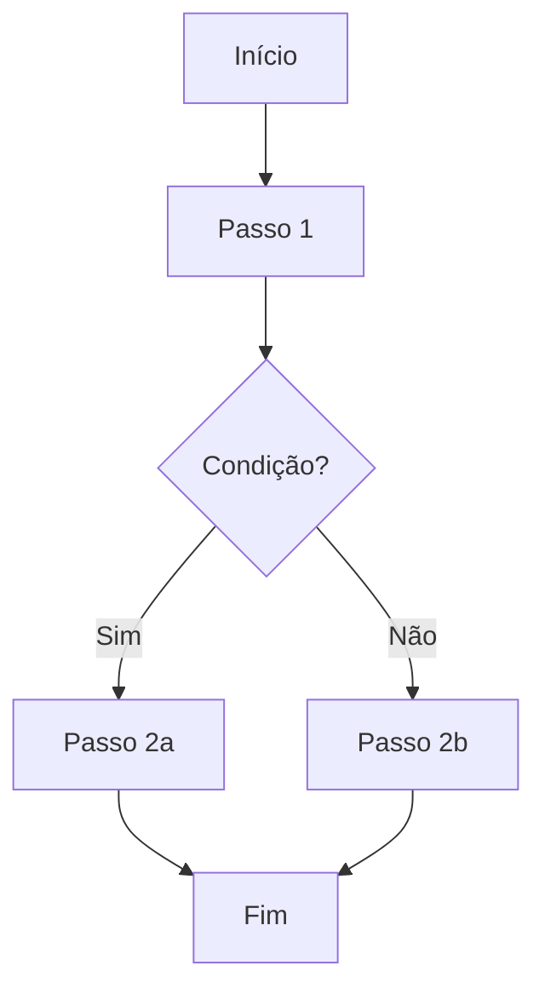

# [Nome da Diretriz]

> **Status**: 🟡 Rascunho | 🟢 Ativa | 🔴 Depreciada
> **Última atualização**: [Data]
> **Scripts relacionados**: `execution/[script].py`

## Objetivo

Descreva de forma clara e objetiva o que esta tarefa deve alcançar.

## Pré-requisitos

- [ ] Dependência ou configuração necessária
- [ ] Variáveis de ambiente configuradas no `.env`

## Entradas (Inputs)

| Parâmetro    | Tipo   | Obrigatório | Descrição              |
|-------------|--------|-------------|------------------------|
| `param_1`   | string | ✅ Sim      | Descrição do parâmetro |
| `param_2`   | int    | ❌ Não      | Descrição do parâmetro |

## Ferramentas Utilizadas

- `execution/nome_do_script.py` — Descrição do que faz

## Fluxo de Execução

1. **Passo 1**: Descrição detalhada
2. **Passo 2**: Descrição detalhada
3. **Passo 3**: Descrição detalhada

## Saídas Esperadas (Outputs)

- **Sucesso**: Descrição do resultado esperado
- **Formato**: JSON / CSV / Texto / etc.
- **Destino**: Onde o resultado é salvo ou enviado

## Casos Extremos (Edge Cases)

| Cenário                    | Comportamento Esperado        |
|---------------------------|-------------------------------|
| API fora do ar            | Retry 3x com backoff de 5s   |
| Dados de entrada vazios   | Retornar erro com mensagem   |
| Limite de rate excedido   | Aguardar e tentar novamente  |

## Tratamento de Erros

- **Erro X**: Ação a ser tomada
- **Erro Y**: Ação a ser tomada

## Histórico de Aprendizados

> Registre aqui tudo que aprender ao executar esta diretriz. Isso torna o sistema cada vez mais forte.

- `[YYYY-MM-DD]` — Descrição do aprendizado
